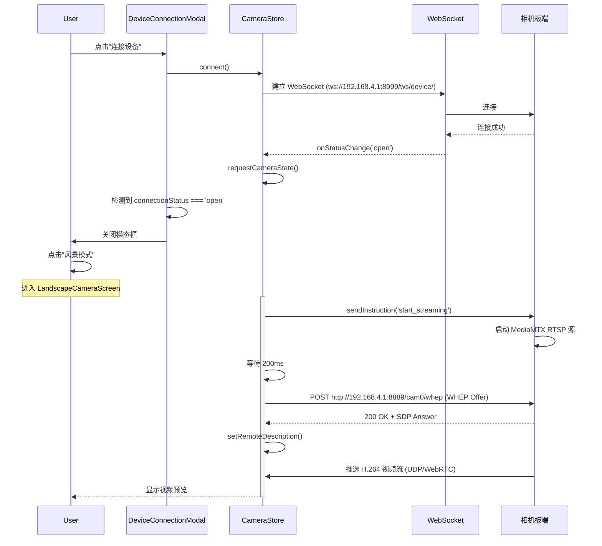

# 相机模式无法打开问题修复

## 问题现象

用户点击首页的"风景模式"、"星空模式"、"行星模式"等任何拍摄模式，都无法正常打开相机预览界面。

## 根本原因

通过终端日志分析，发现 **WHEP 视频流连接失败**（`Network request failed`）：

```
WARN  [CameraWHEP] [TypeError: Network request failed]
```

问题源于：

1. **环境配置错误**：`.env` 文件配置的是 USB ADB 开发模式
   - 控制 API: `http://10.0.2.2:18999` (ADB forward)
   - WHEP 视频流: `http://10.0.2.2:18787/board-webrtc/cam0/whep` (USB 中继)

2. **实际使用场景**：用户通过 **WiFi 直连相机热点**，而不是 USB
   - 相机默认 AP 模式 IP: `192.168.4.1`
   - 控制 API 端口: `8999`
   - WHEP 视频流端口: `8889`

3. **连接模态框未实际连接**：`DeviceConnectionModal` 只是 mock 实现，点击"连接"后并没有调用 `cameraStore.connect()`

## 技术细节

### WebRTC 视频流架构

```
相机板端 (192.168.4.1)
├── 控制 WebSocket (端口 8999/ws/device/)
│   └── 接收指令: start_streaming, stop_streaming, switch_wifi_band, etc.
└── MediaMTX WHEP 端点 (端口 8889/cam0/whep)
    └── 推送 H.264 视频流 (通过 WebRTC)

App 端
├── CameraStore (Zustand)
│   └── 管理 WebSocket 连接和状态
├── useLandscapeCameraPreview Hook
│   ├── 1. 发送 start_streaming 指令
│   ├── 2. 等待 200ms (让板端启动 RTSP 源)
│   └── 3. 调用 openWhepSession() 建立 WebRTC 连接
└── PreviewSurface (RTCView)
    └── 渲染视频流
```

### 连接流程



## 修复内容

### 1. 修改 `.env` 配置为 WiFi 直连模式

```diff
-# USB ADB test mode: MuMu -> 10.0.2.2:18999 -> adb forward -> board 8999.
-EXPO_PUBLIC_CAMERA_BASE_URL=http://10.0.2.2:18999
-EXPO_PUBLIC_CAMERA_WHEP_URL=http://10.0.2.2:18787/board-webrtc/cam0/whep
+# WiFi Direct Mode: Connect to camera's WiFi hotspot directly
+# Camera's default AP mode IP address is 192.168.4.1
+EXPO_PUBLIC_CAMERA_BASE_URL=http://192.168.4.1:8999
+EXPO_PUBLIC_CAMERA_WHEP_URL=http://192.168.4.1:8889/cam0/whep
+
+# USB ADB test mode (commented out - use this when testing via USB):
+# EXPO_PUBLIC_CAMERA_BASE_URL=http://10.0.2.2:18999
+# EXPO_PUBLIC_CAMERA_WHEP_URL=http://10.0.2.2:18787/board-webrtc/cam0/whep
```

### 2. 修复设备连接模态框

**文件**: `src/features/home/components/device-connection-modal.tsx`

```typescript
// 1. 导入 CameraStore
import { useCameraStore } from '../camera/camera-store';

// 2. 获取连接方法和状态
const connect = useCameraStore.use.connect();
const connectionStatus = useCameraStore.use.connectionStatus();

// 3. 真正连接到相机
function handleConnect(deviceId: string, deviceName: string) {
  setConnecting(true);
  saveToHistory(deviceId, deviceName);

  // 调用 CameraStore 的 connect() 建立 WebSocket 连接
  connect();
}

// 4. 监听连接成功后自动关闭模态框
useEffect(() => {
  if (connectionStatus === 'open' && connecting) {
    setConnecting(false);
    onClose();
  }
}, [connectionStatus, connecting, onClose]);
```

## 验证步骤

### 重启应用加载新配置

由于修改了 `.env` 环境变量，**必须重启 Expo 开发服务器和 App**：

```bash
# 1. 停止当前运行的 Expo 服务器 (Ctrl+C)

# 2. 清理缓存并重启
npx expo start --clear

# 3. 在模拟器/真机中完全关闭并重新打开 App
# (不要用热重载，要完全重启)
```

### 测试流程

1. **连接相机 WiFi**
   - 手机/模拟器连接到相机的 WiFi 热点 (SSID 通常是 `WiFi-Camera` 或类似名称)
   - 默认密码通常在相机说明书或设备上

2. **打开 App 首页**
   - 应该显示"设备未连接"卡片

3. **点击"连接设备"按钮**
   - 弹出连接模态框
   - 点击扫描到的 `Wi-Fi Camera` 设备
   - 应该在 2-5 秒内建立 WebSocket 连接
   - 模态框自动关闭，首页显示电池电量、存储空间等设备信息

4. **点击"风景模式"**
   - 应该进入相机界面
   - 顶部显示视频预览 (大约 1-2 秒后出现画面)
   - 底部显示拍摄按钮、参数调节等控件

5. **点击快门按钮**
   - 应该能正常拍照并保存

### 验证日志

正常情况下的终端日志应该是：

```
INFO  [WHEP] 开始协商视频流 { whepUrl: 'http://192.168.4.1:8889/cam0/whep' }
LOG   [CameraWHEP] POST 201 attempt=1
INFO  [WHEP] 视频流已连接 { liveSessionCount: 1 }
LOG   rn-webrtc:pc:DEBUG 1 ctor +0ms
LOG   rn-webrtc:pc:DEBUG 1 addTransceiver +1ms
LOG   rn-webrtc:pc:DEBUG 1 addTransceiver +2ms
LOG   rn-webrtc:pc:DEBUG 1 createOffer +3ms
LOG   rn-webrtc:pc:DEBUG 1 createOffer OK +5ms
LOG   rn-webrtc:pc:DEBUG 1 setRemoteDescription +10ms
LOG   rn-webrtc:pc:DEBUG 1 setRemoteDescription OK +8ms
```

## 常见问题

### Q: 重启后还是连接失败？

**A**: 检查以下几点：
1. 确认手机/模拟器已连接到相机的 WiFi 热点
2. 检查相机是否已开机并正常工作
3. 尝试在浏览器访问 `http://192.168.4.1:8999` 看是否能访问
4. 如果相机 IP 不是 `192.168.4.1`，修改 `.env` 中的地址

### Q: WebSocket 连接成功但视频流失败？

**A**: 检查 WHEP 端口是否正确：
- MediaMTX 默认端口是 `8889`
- 尝试访问 `http://192.168.4.1:8889/cam0/` 查看端点是否存在

### Q: 如何切换回 USB ADB 模式？

**A**: 修改 `.env` 文件，取消注释 USB 配置：

```bash
# 注释掉 WiFi 配置
# EXPO_PUBLIC_CAMERA_BASE_URL=http://192.168.4.1:8999
# EXPO_PUBLIC_CAMERA_WHEP_URL=http://192.168.4.1:8889/cam0/whep

# 启用 USB 配置
EXPO_PUBLIC_CAMERA_BASE_URL=http://10.0.2.2:18999
EXPO_PUBLIC_CAMERA_WHEP_URL=http://10.0.2.2:18787/board-webrtc/cam0/whep
```

然后重启 Expo 服务器。

## 相关文件

- `.env` - 环境变量配置
- `src/features/home/components/device-connection-modal.tsx` - 连接模态框
- `src/features/home/camera/camera-store.ts` - 相机状态管理
- `src/features/home/camera/config.ts` - 相机 API 配置
- `src/features/home/camera/services/whep-service.ts` - WHEP 视频流客户端
- `src/features/home/camera/components/native-camera-preview.tsx` - 预览组件
