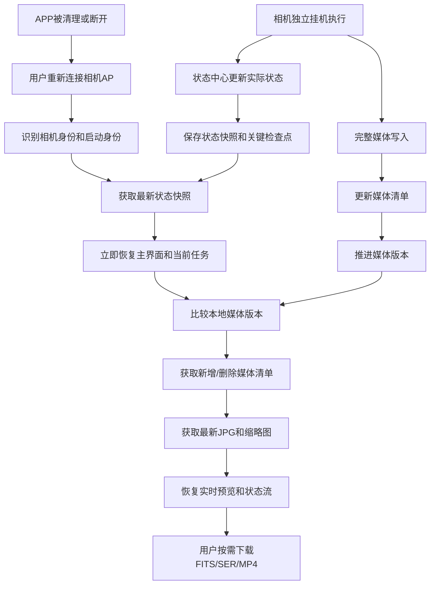

# WiFi 天文相机嵌入式应用层与断连同步完整架构

> 适用对象：WiFi 天文相机固件、Linux 应用层、驱动层、APP 和系统测试团队。
>
> 本文承接：
>
> - `outputs/10-数据流分层图-最终版.html`
> - `outputs/13-全系统可修改流程图重建设计说明.md`
> - `outputs/14-基于能力开关与状态组合的系统架构.md`
>
> 本文新增并重点固化：带电池相机的断连挂机、APP 被后台清理、重连状态同步、媒体差异同步和传输优先级。
>
> 本文定义产品级架构、责任边界、状态关系、数据流、同步时序和异常行为；不替研发定义 API 路径、消息字段、端口、线程、寄存器、文件命名细节或算法内部实现。

---

## 1. 架构结论

这台相机必须按照“板端独立运行、APP 随时加入”的模型设计。

```text
相机板端：持续运行并保存真实状态
APP：连接时观察和控制，断开后可以完全消失
重连：APP重新获取板端状态和媒体变化，重新构建界面
```

板端是唯一事实来源，APP 本地缓存只能用于加速，不能决定相机当前真实状态。

系统不应该依赖：

- APP 进程一直存活。
- APP 记得上次页面停在哪里。
- APP 保留着上次任务对象。
- APP 能够接收到每一条实时事件。
- APP 每次都从头扫描整个 TF 卡。

系统必须允许以下情况正常发生：

```text
用户提交深空计划
→ APP退出或被系统清理
→ 相机继续挂机拍摄
→ 用户数分钟或数小时后重新连接
→ APP快速显示当前任务、进度、最新结果和新增文件
```

---

## 2. 产品场景

### 2.1 相机网络形态

- 相机自身作为 WiFi AP 热点。
- 用户手机或电脑连接相机 AP。
- 相机带电池，可以脱离手机独立工作。
- WiFi 断开不等于相机停止。
- APP 被后台清理不等于任务取消。
- 用户可能在任意时刻重新连接，包括曝光中、写盘中、叠加中和计划执行中。

### 2.2 四类主要工作模式

| 模式 | 是否拍摄模式 | 主要结果 | 是否支持计划 |
|---|---|---|---|
| 风光 | 是 | H.264、MP4/SER、FITS | 支持 |
| 行星 | 是 | H.264、MP4/SER、FITS | 支持 |
| 深空 | 是 | FITS、拉伸 JPG、叠加 JPG | 支持 |
| 寻星 | 否 | RA/Dec、星图和当前指向 | 不支持 |

### 2.3 核心拍摄规则

- CMOS 每完成一帧，产生完整 RAW。
- RAW 同时进入 RAW 底层流和 ISP/H.264 预览流。
- 风光和行星视频可保存 MP4 或 SER。
- 风光和行星照片保存 FITS。
- 行星 ROI 使用滑杆无级裁切，分辨率必须为 16:9，宽高为偶数。
- 深空使用 1/4s H.264 取景，单张曝光 1–60s。
- 深空 FITS 必须先完整写入 TF 卡，收到写入完成事件后才能入叠加队列。
- 第一张深空 FITS 直接拉伸；第二张起运行自研叠加。
- 每加入一张完整 FITS，都生成并推送一次最新 JPG。
- 曝光大于 10s 才允许启用深空叠加。

---

## 3. 总体架构

系统分成控制面、数据面、事件面、持久化面和同步面。

```text
                    ┌──────────────────────────────┐
                    │          APP / 用户             │
                    │  提交意图、显示状态、浏览结果     │
                    └──────────────┬───────────────┘
                                   │ 用户命令 / 查询
                                   ▼
┌─────────────────────────────────────────────────────────┐
│                Linux 应用层：控制面                       │
│  事件入口 → 意图归一化 → 任务编排 → 资源调度 → 命令下发    │
│                         ▲                │                │
│                         │ 完成事件        ▼                │
│                   实际状态中心      异步功能服务            │
└─────────────────────────────────────────────────────────┘
                                   │
             ┌─────────────────────┼─────────────────────┐
             ▼                     ▼                     ▼
       驱动采集执行          Linux 数据处理          驱动 I/O 执行
       CMOS / RAW / ISP      H.264 / FITS / 叠加      TF / WiFi / Flash
             │                     │                     │
             └─────────────────────┼─────────────────────┘
                                   ▼
                         持久化状态与媒体清单
                                   │
                                   ▼
                             重连同步协调器
                                   │
                                   ▼
                         APP 状态和媒体差异同步
```

### 3.1 控制面

控制面决定：

- 用户想做什么。
- 当前模式是否允许这个任务。
- 参数是否需要自动归一化。
- 资源是否可以立即使用、排队或延迟切换。
- 下一步应该等待哪个完成事件。
- 当前任务应该继续、停止、降级还是形成终态。

### 3.2 数据面

数据面负责真实数据流动：

```text
完整 RAW
  ├─→ ISP → H.264 → APP 预览 / MP4
  └─→ RAW底层流 → SER / FITS / 深空 / Plate Solving
```

RAW、H.264、FITS、JPG 和原始视频不应该通过状态事件通道传输。事件通道只传状态、进度、完成结果和数据引用。

### 3.3 事件面

事件面负责异步推进：

- 参数已生效。
- 采集已启动。
- 帧已完成。
- 文件已写入完成。
- FITS 已进入队列。
- JPG 已生成。
- 任务已完成、失败或取消。
- 电量、温度、存储和网络状态发生变化。

### 3.4 持久化面

持久化面保存：

- 当前任务检查点。
- 当前状态快照。
- 计划进度。
- 已完成媒体清单。
- 状态和媒体变化版本。
- 低电量或异常关机前的最后安全状态。

### 3.5 同步面

同步面负责：

- APP 重新连接时快速获得当前状态。
- 判断 APP 离线期间发生了哪些状态变化。
- 判断新增、删除和变更了哪些媒体。
- 优先发送用户最需要看到的内容。
- 避免重连同步影响当前拍摄、写盘和叠加任务。

---

## 4. 三条核心原则

### 4.1 板端是真实状态源

APP 显示的模式、任务、参数、进度、文件和错误都以板端为准。

APP 本地可以保存：

- 上次连接的相机身份。
- 上次看到的状态版本。
- 上次看到的媒体版本。
- 已经缓存的缩略图和文件标识。

但 APP 不能依赖本地状态判断相机是否仍在拍摄。

### 4.2 用户输入尽量自动修正

内部校验必须严格，但用户体验必须宽容。

```text
APP端限制明显错误输入
→ Linux端再次归一化
→ 可以修正就静默修正
→ 可以等待就排队或延迟
→ 可以降级就保持任务完成
→ 只有无法完成用户目的时才报错
```

例如 ROI 不是偶数，不应该优先弹窗，而应调整到最近合法偶数，并把实际生效值同步回 APP。

### 4.3 断连不改变任务生命周期

WiFi 状态和任务状态是两个不同状态轴：

```text
WiFi：未连接 ↔ 已连接 ↔ 重连同步
任务：空闲 → 执行中 → 收尾 → 完成/失败/取消
```

APP 断连只影响观察和控制，不自动影响已经下发到板端的挂机任务。

---

## 5. Linux 应用层模块划分

### 5.1 事件入口

输入来源包括：

- APP 用户意图。
- 电源键和 Reset。
- USB 插拔。
- 电量和温度事件。
- 驱动采集事件。
- TF 写入事件。
- 算法处理事件。
- WiFi 连接和断开事件。

职责：

- 接收并分类事件。
- 关联当前任务。
- 防止重复处理同一事件。
- 交给正确的控制模块。

它不决定业务任务是否继续，也不直接操作驱动。

### 5.2 意图归一化器

职责：

- 将 APP 输入转换为板端理解的产品意图。
- 对曝光、增益、ROI、分辨率等参数进行范围限制和自动修正。
- 自动补齐模式所需的基础能力。
- 把互斥选择整理成唯一任务用途。
- 将实际生效配置反馈给 APP。

它的目标不是“尽量拒绝”，而是“尽量让用户目的成功”。

### 5.3 模式策略中心

模式只提供策略和约束，不各自实现底层任务。

| 模式 | 策略 |
|---|---|
| 风光 | 全幅、短曝光、AE/AG、视频或照片 |
| 行星 | ROI、16:9、偶数宽高、视频 8bit |
| 深空 | 1/4s 取景、1–60s 长曝光、FITS、叠加条件 |
| 寻星 | 解析图像、Plate Solving、陀螺仪、星图，不支持计划 |

### 5.4 任务编排器

任务编排器是唯一的任务推进者。

职责：

- 创建任务。
- 保存任务快照。
- 记录任务当前阶段。
- 记录正在等待的完成事件。
- 按依赖顺序下发命令。
- 根据完成事件推进下一步。
- 统一处理停止、取消、失败和恢复。
- 让计划拍摄重复调用同一个任务单元。

它不能阻塞等待一整条拍摄链路结束。

### 5.5 资源调度器

资源调度器不应该只判断“占用/未占用”，而应该判断当前资源能力和负载。

主要资源：

- Sensor。
- ISP 和 H.264 编码。
- RAW 缓冲。
- TF 卡写入带宽。
- TF 卡剩余空间。
- 深空队列和算法处理能力。
- WiFi 发送带宽。
- Flash 写入能力。

资源调度结果可以是：

```text
立即执行 / 排队等待 / 到安全点后切换 / 降级执行 / 阻断
```

只有最后一种才需要用户看到阻断错误。

### 5.6 实际状态中心

职责：

- 汇总各服务局部状态。
- 维护当前任务和系统状态。
- 生成对 APP 的完整状态快照。
- 推进状态版本。
- 生成关键检查点。
- 为重连同步协调器提供权威数据。

它是状态的汇总者，不是所有功能逻辑的堆积处。

### 5.7 媒体清单中心

职责：

- 维护已经完整生成的媒体记录。
- 记录媒体类型和所属任务。
- 记录是否存在预览JPG或缩略图。
- 记录新增、删除和状态变化。
- 为重连时的媒体差异同步提供依据。

媒体清单不应该把完整图片或视频放进去，只保存轻量索引和状态。

### 5.8 重连同步协调器

职责：

- 识别 APP 是首次连接、普通重连还是相机重启后的重连。
- 先同步状态，再同步媒体变化。
- 控制同步流量优先级。
- 避免同步过程影响当前拍摄和写盘。
- 让 APP 获取当前最新结果，而不是补发大量过期结果。

---

## 6. 异步任务控制模型

### 6.1 控制流程

```text
APP提交用户意图
  → 意图归一化
  → 模式策略补齐约束
  → 资源调度
  → 创建目标任务
  → 按阶段下发命令
  → 服务异步执行
  → 服务发布完成事件
  → 状态中心更新实际状态
  → 编排器继续下一阶段
```

### 6.2 主任务状态

```text
已创建
  → 参数归一化
  → 等待资源
  → 准备中
  → 运行中
  → 等待文件完成
  → 等待算法结果
  → 收尾中
  → 已完成 / 已失败 / 已取消
```

### 6.3 局部状态不合并成巨大状态机

| 状态轴 | 典型状态 |
|---|---|
| 系统 | 启动中、空闲、运行、停止中、恢复中、安全关机 |
| 连接 | 未连接、已连接、重连同步 |
| 主任务 | 创建、准备、运行、收尾、完成、失败、取消 |
| 采集 | 未启动、配置、曝光、读出、帧完成 |
| 存储 | 空闲、组织、写入、完成、失败 |
| 算法 | 等待输入、处理中、结果就绪、失败 |
| 计划 | 无计划、执行中、已完成、已停止、失败 |

任务编排器只需要记录当前任务阶段和等待条件，不需要把所有局部状态组合成一个巨大枚举。

---

## 7. 板端持久化设计

板端至少维护三类持久化信息，不能只依赖一个不断膨胀的状态文件。

### 7.1 当前状态快照

这是小型、可快速读取的权威状态文件，表达“现在是什么状态”。

概念内容包括：

- 相机身份和本次启动身份。
- 当前模式和实际生效参数。
- 当前主任务及任务阶段。
- 计划总帧数、完成帧数和当前帧。
- 当前曝光、读出、写盘或算法阶段。
- 最新完成媒体引用。
- 最新深空JPG引用。
- 电量、温度、TF容量和错误。
- 状态版本。
- 媒体清单版本。

它不保存：

- 全部照片内容。
- 全部视频内容。
- 每秒一条的实时进度。
- 无限增长的事件历史。

### 7.2 任务检查点

任务检查点记录“突然断电后仍然必须知道的进度”。

建议在以下节点更新：

- 计划创建。
- 模式和参数确定。
- 每一帧完整写入。
- 每一帧任务完成。
- 深空FITS写入完成。
- 叠加结果更新。
- 任务完成、失败或取消。
- 低电量保护。
- 安全关机前。

不建议每个实时进度变化都写入Flash，以减少写入磨损。

### 7.3 媒体清单

媒体清单维护已经确认存在的文件和预览结果。

概念内容包括：

- 媒体唯一标识。
- 所属任务和帧序号。
- 文件类型。
- 是否完整。
- 是否可预览。
- 是否已有缩略图。
- 是否已删除。
- 生成顺序或媒体版本。

媒体清单应该可以增量更新，不需要每次重连重新扫描整个TF卡。

### 7.4 关键事件记录

如果需要支持差异同步，可以维护有限长度的事件记录或变化记录：

- 只保存关键任务和媒体变化。
- 可以是循环存储，不无限增长。
- 过期后不影响正确性，因为仍可通过全量快照和媒体清单重建。

事件记录是优化，不是正确性的唯一基础。

---

## 8. 状态文件的安全更新

状态文件和媒体清单都必须考虑电池突然断电或系统崩溃。

推荐的产品语义：

```text
生成新版本临时内容
  → 完成写入和校验
  → 替换为当前版本
  → 保留上一份可恢复版本
```

媒体文件也采用类似原则：

```text
临时文件写入
  → 写入完成
  → 关闭并确认
  → 标记媒体完整
  → 更新媒体清单
  → 发布文件完成事件
```

APP只能看到媒体清单中已经确认完整的文件。

如果发生断电：

- 临时文件不能被当成完整照片。
- 已完整写入的FITS必须保留。
- 未完成文件标记为中断或清理候选。
- 任务检查点用于恢复上次任务阶段。

是否自动续拍由产品另行决定，但已完成数据和中断原因必须可恢复。

---

## 9. APP 重连同步流程

### 9.1 总体时序

```text
用户连接相机AP
  → APP建立应用连接
  → 获取相机身份和启动身份
  → 获取最新状态快照
  → APP立即重建主界面
  → 比较媒体清单版本
  → 获取新增/删除/变更媒体清单
  → 优先获取最新预览结果
  → 后台补齐新增缩略图
  → 恢复H.264、进度、坐标和状态流
  → 原始文件按用户需要下载
```

### 9.2 第一步：识别相机身份

APP需要知道：

- 连接的是不是上次那台相机。
- 相机有没有重启过。
- 当前是不是新的运行周期。

如果相机重启过，APP不能假设上一次的临时状态仍然存在，应以当前状态快照重新建立界面。

### 9.3 第二步：状态快照优先

状态快照应当足够小，优先传输。

APP首先需要知道：

- 当前模式。
- 当前任务。
- 当前阶段。
- 计划进度。
- 当前帧和最新完成帧。
- 电量和存储。
- 最新照片或JPG。
- 当前错误或警告。

拿到快照后，APP就能先显示正确的任务界面，不必等待相册同步完成。

### 9.4 第三步：媒体差异

APP将本地保存的媒体版本与板端媒体版本比较。

如果存在变化：

```text
获取新增媒体记录
获取删除媒体记录
获取预览关系变化
更新本地相册索引
```

如果APP没有本地版本，例如首次连接或本地数据被清理，则执行一次完整媒体清单同步。

### 9.5 第四步：最新结果优先

不同任务的优先结果不同：

| 当前任务 | 重连后优先显示 |
|---|---|
| 风光视频 | 当前H.264预览和最新视频文件信息 |
| 行星视频 | H.264预览、实时帧率和当前录像进度 |
| 风光/行星照片 | 最新完成FITS的预览关系 |
| 深空单帧 | 最新拉伸JPG和最新FITS状态 |
| 深空叠加 | 最新叠加JPG、当前叠加帧数和最新FITS |
| 计划拍摄 | 当前帧、总帧、完成文件和任务阶段 |
| 寻星 | 当前RA/Dec、星图状态和当前指向 |

深空叠加期间产生的过期JPG不必逐张补发，直接同步最新JPG即可。

---

## 10. APP 被后台清理后的处理

APP被系统清理后，不能保留任何“必须依赖内存”的状态。

### 10.1 板端继续执行

只要用户已经提交并确认了计划：

- APP断开不停止计划。
- 当前曝光继续完成。
- FITS继续写盘。
- 深空叠加继续运行。
- 计划继续推进下一帧。
- 关键检查点继续持久化。

### 10.2 APP重新启动

APP启动后不重放旧命令，先获取板端实际状态。

例如：

```text
APP上次发送“开始叠加”后被杀掉
→ APP重新连接
→ 发现相机已处于第8帧叠加中
→ 直接恢复“深空叠加进行中”页面
```

这样不会重复创建任务或重复拍摄。

### 10.3 用户操作保护

状态同步完成前：

- 不立即执行APP残留的旧按钮动作。
- 不自动重发上次未确认的命令。
- 界面先显示“正在恢复相机状态”。
- 状态明确后再开放拍摄、停止和设置操作。

---

## 11. 媒体同步策略

### 11.1 不自动下载全部原始文件

FITS、SER和MP4可能很大。重连时自动下载全部原始文件会：

- 占用热点带宽。
- 影响H.264预览。
- 影响当前FITS或视频写入。
- 消耗相机电量。
- 让APP长时间处于同步状态。

因此重连同步默认只做：

```text
媒体清单 + 缩略图 + 最新结果
```

原始文件按用户浏览或下载时再传输。

### 11.2 媒体同步阶段

```text
阶段A：媒体清单
阶段B：任务相关最新预览
阶段C：新增缩略图
阶段D：用户主动下载原始文件
```

用户可以在阶段C尚未结束时正常使用APP，不需要等待全部照片同步。

### 11.3 文件完整性

只有媒体清单标记为完整的文件才能：

- 出现在相册。
- 生成下载入口。
- 被标记为任务结果。
- 作为深空队列输入。

正在写入的FITS不能进入深空队列，也不能在APP中显示为完成照片。

---

## 12. 传输优先级

相机作为热点，网络带宽和电量有限，因此同步、预览和文件下载必须由统一发送调度器安排。

建议优先级：

```text
P0：停止、错误、低电量、安全状态
P1：状态快照、任务进度、实际生效参数
P2：最新深空JPG、当前缩略图、坐标和星图状态
P3：H.264实时预览
P4：媒体清单和新增缩略图
P5：FITS、SER、MP4原始文件下载
```

优先级并不是固定带宽比例，而是保证关键任务和状态优先。

例如：

- 深空长曝光时，优先发送曝光进度和上一张JPG。
- 录像时，保证MP4/SER持续写入，下载旧文件可以暂缓。
- 重连时，先发快照和最新结果，再恢复预览。
- APP请求下载大文件时，不能阻塞任务状态和停止命令。

---

## 13. 断连和重连的典型场景

### 13.1 风光视频挂机

```text
用户选择风光视频
→ 开始MP4或SER
→ APP断开
→ 相机继续录制和写文件
→ APP重新连接
→ 显示正在录制、录制时长和文件增长状态
→ 恢复H.264预览
→ 完成后媒体清单出现完整视频
```

### 13.2 行星计划挂机

```text
用户设置ROI、曝光、增益和X帧计划
→ 计划开始
→ APP被清理
→ 板端逐帧执行
→ 每帧完成后更新检查点和媒体清单
→ APP重新连接
→ 显示当前帧/总帧和新增文件
```

### 13.3 深空叠加挂机

```text
第1帧FITS写入完成
→ 首帧拉伸JPG
→ APP断开
→ 第2、3、4帧继续拍摄
→ 每张FITS完成后入队并生成最新JPG
→ APP重新连接
→ 获取当前队列帧数和最新JPG
→ 不补发已经过期的中间JPG
```

### 13.4 APP在曝光期间重新连接

```text
相机正在长曝光
→ APP重新连接
→ 状态快照显示当前处于曝光中
→ APP显示进度
→ 不为了恢复H.264而中断曝光
→ 曝光完成后正常进入FITS和后处理
```

### 13.5 相机低电量关机

```text
电量进入保护区间
→ 停止启动新帧
→ 当前曝光或写盘按规则收尾
→ 保存任务检查点
→ 关闭文件
→ 更新任务终态
→ 安全关机
→ 下次开机扫描并恢复有效文件和中断任务信息
```

---

## 14. 用户友好的校验和同步体验

### 14.1 参数不合法

```text
APP滑杆尽量只产生合法参数
→ Linux再次归一化
→ 自动调整到最近合法值
→ APP显示实际生效值
```

例如：

- ROI不是偶数：调整到最近偶数。
- ROI不是16:9：调整到最近合法比例。
- 曝光超范围：限制到模式允许范围。
- 叠加条件未满足：隐藏或暂不启用叠加入口。

### 14.2 资源暂时繁忙

```text
能排队：排队
能等安全点：延迟到安全点
能降级：降级并显示实际状态
无法保证结果：才阻断
```

不要因为TF卡正在写上一张FITS，就立刻弹“TF卡被占用”。应优先判断当前请求是否能排队。

### 14.3 重连中的APP体验

APP不应该显示空白首页或要求用户重新选择模式，而应按以下阶段呈现：

```text
正在连接相机
→ 正在恢复拍摄状态
→ 已恢复当前任务
→ 正在同步新增照片
```

其中“任务已恢复”应早于“全部照片已同步”。

---

## 15. 统一停止和异常恢复

### 15.1 停止顺序

```text
停止命令或异常
→ 任务进入停止中
→ 禁止启动新帧
→ 等待当前采集到安全点
→ 等待已经开始的处理
→ 等待已经开始的文件写入
→ 更新媒体清单
→ 保存任务检查点
→ 形成完成/失败/取消
→ 释放资源
```

### 15.2 APP断开期间发生错误

APP不在线时，错误仍然必须在板端完成处理：

- 任务错误进入状态快照。
- 计划根据规则停止、跳过或继续。
- 文件错误进入媒体清单。
- 电量和温度保护优先级最高。
- APP重连后查看最终结果和错误原因。

APP不在线不是不处理错误的理由。

### 15.3 不能悄悄丢失的结果

以下结果一旦完成就必须保留记录：

- 已完整写入的FITS。
- 已完整写入的MP4或SER。
- 已生成的最新深空JPG。
- 已完成的计划帧。
- 已形成的任务终态。

---

## 16. APP本地数据职责

APP本地保存的内容主要用于加速显示，不是板端事实源。

建议保存：

- 相机身份。
- 上次状态版本。
- 上次媒体版本。
- 已下载媒体索引。
- 已缓存的缩略图。
- 用户界面偏好。

APP重新安装、清理缓存或更换手机后，仍然可以通过板端状态快照和媒体清单重新构建全部内容。

APP本地不应该保存：

- “相机当前是否正在拍”的最终判断。
- “计划已经完成多少帧”的唯一记录。
- 只存在于APP内存中的任务对象。
- 需要APP持续运行才能推进的拍摄状态。

---

## 17. 接口和模块设计原则

本文不定义具体接口，但产品层面建议将控制语义收敛为少量稳定能力：

1. 提交或更新用户意图。
2. 开始当前合法任务。
3. 停止当前任务或计划。
4. 查询当前状态快照。
5. 获取媒体变化和文件信息。
6. 请求预览、缩略图或原始文件。
7. 执行文件和维护操作。

模式、任务用途、参数和计划信息属于用户意图的一部分，不需要为风光、行星、深空分别建立重复控制体系。

---

## 18. 数据同步的正确性边界

### 18.1 必须保证

- APP重连后能获得板端当前状态。
- APP不会把旧命令重复执行。
- 已完成文件不会因为断连而丢失记录。
- 未完成文件不会被误认为完整文件。
- 新增媒体可以被差异同步发现。
- 最新深空JPG可以被快速恢复。
- 计划进度不会依赖APP进程。
- 同步过程不能破坏当前拍摄和写盘。

### 18.2 可以牺牲

- 断连期间的全部实时预览帧。
- 已经过期的中间JPG逐张补发。
- APP本地临时的页面状态。
- 不重要的历史进度细节。

### 18.3 不建议牺牲

- 已完整写入的原始照片和视频。
- 当前任务阶段。
- 计划帧进度。
- 最新深空处理结果。
- 低电量和异常状态。

---

## 19. 资源和同步的相互影响

重连同步不是独立于拍摄的后台任务，它会和拍摄共享：

- WiFi带宽。
- CPU处理能力。
- TF卡读取带宽。
- 电池电量。
- 内存缓存。

因此同步协调器必须服从任务优先级：

```text
拍摄完整性 > 任务状态 > 最新结果 > 实时预览 > 缩略图 > 原始文件下载
```

当用户正在下载大文件时：

- 不得阻塞停止命令。
- 不得阻塞低电量状态。
- 不得影响当前FITS或视频写入。
- 可以降低下载速度或暂停下载。

---

## 20. 建议的状态和媒体同步流程图



---

## 21. 研发模块责任矩阵

| 模块 | 负责 | 不负责 |
|---|---|---|
| 任务编排器 | 任务阶段、等待事件、继续/停止/恢复 | 直接处理RAW或写TF |
| 状态中心 | 实际状态、快照、版本、检查点 | 自己启动采集或算法 |
| 媒体清单中心 | 完整文件索引和媒体变化 | 保存完整媒体内容 |
| 重连同步协调器 | 快照、媒体差异、同步优先级 | 改变拍摄任务结果 |
| 采集服务 | Sensor、曝光、RAW读出 | 决定文件用途 |
| 预览编码服务 | ISP、H.264、帧率 | 决定任务终态 |
| 存储服务 | MP4、SER、FITS、JPG实际写入 | 决定模式策略 |
| 图像处理服务 | 拉伸、叠加、Plate Solving | 修改全局任务状态 |
| WiFi发布服务 | 状态、预览、结果和文件发送 | 决定发送内容优先级以外的任务逻辑 |
| APP | 用户操作、显示、浏览、下载 | 作为板端任务的事实源 |

---

## 22. 典型完整场景：深空叠加断连重连

### 22.1 APP在线开始

```text
APP选择深空叠加
→ 板端归一化曝光、增益和叠加条件
→ 创建叠加任务
→ 保存任务检查点
→ 开始第一张长曝光
```

### 22.2 APP被清理

```text
APP被系统清理
→ WiFi连接状态变为未连接
→ 任务保持运行
→ 第1张RAW形成完整FITS
→ TF写入完成
→ FITS进入队列
→ 首帧拉伸产生JPG
→ 更新状态快照、媒体清单和最新结果
→ 继续第2张
```

### 22.3 APP重新连接

```text
APP连接AP
→ 获取相机身份
→ 获取当前状态快照
→ 显示深空叠加进行中
→ 显示当前完成帧数
→ 获取最新叠加JPG
→ 获取离线期间新增FITS清单
→ 后台加载新增缩略图
→ 恢复1/4s取景或当前可用实时结果
```

APP不需要知道断连期间每一张JPG的传输过程，只需要恢复当前真实结果。

---

## 23. 典型完整场景：计划拍摄断电重启

```text
计划已下发
→ 完成第1帧并更新检查点
→ 正在第2帧时电量不足
→ 停止启动新帧
→ 当前帧按规则收尾
→ 保存中断原因和已完成帧数
→ 安全关机
→ 用户再次开机并连接
→ 状态快照显示上次计划已中断
→ 媒体清单显示已完成文件
→ APP根据产品规则提供继续、结束或查看结果
```

自动续拍还是人工确认继续，属于产品策略；但恢复信息必须完整存在。

---

## 24. 用户体验规则

### 24.1 不弹窗的情况

- ROI被调整到最近合法值。
- 分辨率被调整为合法偶数。
- 请求进入短暂等待队列。
- 参数安排到下一帧生效。
- 重连时后台同步缩略图。
- 旧JPG跳过，只恢复最新JPG。
- WiFi传输暂时降速。

### 24.2 轻提示的情况

- 正在恢复相机状态。
- 正在同步新增照片。
- 当前参数将在下一帧生效。
- 原始文件下载暂时让位于当前拍摄。
- 预览暂时降低刷新速度。

### 24.3 必须明确阻断的情况

- 没有存储空间且任务必须保存文件。
- 存储介质损坏。
- 破坏性操作与拍摄冲突，例如格式化正在写入的TF卡。
- 电量不足以安全完成必要的写盘。
- 驱动故障导致无法继续采集。
- 无法保证用户要求的原始数据完整性。

---

## 25. 建议实施顺序

### 第一阶段：板端状态快照

- 建立当前状态的权威来源。
- 能够在APP完全消失后继续维护任务。
- 关键节点保存检查点。
- 任务完成、失败、取消后状态可恢复。

### 第二阶段：完整媒体清单

- 文件只有完整后才进入清单。
- 清单与媒体内容分开。
- 支持新增、删除和完成状态变化。
- 支持状态版本和媒体版本。

### 第三阶段：重连快速恢复

- 先同步相机身份和状态快照。
- APP先恢复当前任务页面。
- 再同步媒体差异和最新预览。
- 最后恢复实时流和后台缩略图。

### 第四阶段：传输调度

- 控制和状态优先。
- 当前任务结果优先。
- 缩略图和原始文件后台执行。
- 大文件下载不能阻塞拍摄、停止和低电量保护。

### 第五阶段：异常恢复

- 断电临时文件恢复。
- 低电量安全停止。
- 任务中断信息恢复。
- APP重复连接和重复命令保护。

---

## 26. 架构验收标准

- [ ] APP被清理后，板端计划和拍摄仍可独立执行。
- [ ] APP重新连接后先恢复状态，再同步照片。
- [ ] 状态快照是板端权威来源。
- [ ] APP本地缓存丢失后仍可通过板端重建界面。
- [ ] 状态文件不会随着照片数量无限增长。
- [ ] 媒体清单与完整媒体内容分离。
- [ ] 文件未完成时不会出现在已完成媒体中。
- [ ] FITS未写入完成时不会进入深空队列。
- [ ] 重连不自动重放APP上次未确认的命令。
- [ ] 重连时优先恢复任务进度和最新结果。
- [ ] 过期中间JPG可以跳过，只同步最新JPG。
- [ ] 原始FITS、SER、MP4默认不自动全量下载。
- [ ] 大文件同步不会阻塞拍摄、写盘、停止和低电量保护。
- [ ] 断电后可以识别已完成文件和中断任务。
- [ ] 关键任务检查点不会依赖APP在线。
- [ ] 用户输入可自动修正时不弹错误。
- [ ] 只有无法保证任务完整性时才阻断并提示用户。

---

## 27. 最终架构定义

```text
WiFi 天文相机是一个可以脱离APP独立运行的嵌入式任务系统。

APP只提交用户意图并观察结果；
Linux应用层负责意图归一化、任务编排、资源调度、实际状态汇总和重连同步；
驱动层负责采集、数据分流、实际存储和网络执行；
板端通过状态快照、任务检查点和媒体清单保存真实运行结果；
APP随时可以断开、被清理并在之后重新连接，重新连接后先恢复状态，再按差异同步媒体，最后恢复实时流和原始文件下载。
```

这套架构同时解决三件事：

1. 相机可以脱离APP稳定挂机。
2. APP可以随时重新加入而不需要记住过去的内存状态。
3. 大量照片和视频不会因为一次重连而阻塞当前任务和用户体验。
